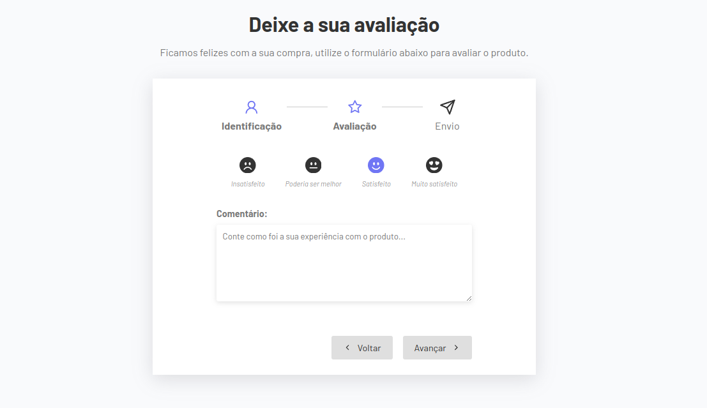

# Formulário Multistep com React

Um projeto para estudo de React, ele foi feito através do curso Formação Front-end do <a href="https://www.udemy.com/user/matheus-battisti/" target="_blank">Matheus Battisti</a>
na plataforma <a href="https://www.udemy.com" target="_blank">Udemy</a>.

## O projeto

Consiste em um formulário de avaliação de produto, permitindo que o usuário se identifique fornecendo seu nome e e-mail antes de deixar sua avaliação sobre o produto. Ao final do processo, a avaliação é exibida na tela e enviada.  
Ele consiste em vários componentes e hooks que trabalham juntos para criar um formulário de avaliação em etapas.

## Componentes Utilizados:

**UserForm:** Componente para coletar o nome e e-mail do usuário.

**ReviewForm:** Componente para permitir que o usuário deixe sua avaliação sobre o produto.

**Thanks:** Componente para exibir uma mensagem de agradecimento após o envio da avaliação.

**Steps:** Componente para mostrar visualmente em qual etapa do formulário o usuário se encontra.

### Hooks Utilizados:

**useForm:** Um hook personalizado para gerenciar o estado do formulário, controlar as etapas e a transição entre elas.

## Funcionalidades Principais:

- O estado do formulário é mantido por meio do hook useState, inicializado com um template de formulário vazio.

- O hook `useForm` é utilizado para controlar as etapas do formulário, determinar o componente atual a ser exibido e gerenciar a transição entre as etapas.

- Os dados do formulário são atualizados dinamicamente à medida que o usuário interage com os campos, utilizando a função `updatedFieldHandler`.

- Botões de navegação permitem que o usuário avance para a próxima etapa, volte para a etapa anterior ou envie a avaliação após completar todas as etapas.

- Ícones de setas (GrFormNext e GrFormPrevious) e um ícone de envio (FiSend) são utilizados para tornar a interface mais intuitiva e visualmente atraente.
